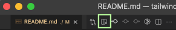

# Tailwind workshop

## Hjelpsomme tegn som går igjen

- <details><summary>Klikk her for å se noe som er skjult</summary>
  </img></details>
- 💡 Tips
- 📜 Oppgave
- 🙈 Løsningsforslag

<br/>

## Noen vennlige ord

- Ikke stress gjennom oppgavene. Du får best utbytte av å ikke hoppe rett på løsningsforslagene.
- Vær nysgjerrig, trykk på lenker, ikke kjenn på at du må bli ferdig.
- Løsningsforslag er forslag og ikke fasit.
- Spør oss om hjelp! Spør sidemannen. Se på løsningsforslag. Google. Ikke sitt i frustasjonen for lenge!
- Følg nysgjerrigheten, og still spørsmål. Det er du som skal lære og ha det gøy!

<br/>

## Lese oppgaver

Oppgavene er skrevet i markdown, og VSCode burde åpne markdown-filer i preview-mode automatisk. Dersom den ikke gjør det kan man åpne de [manuelt i preview](https://code.visualstudio.com/docs/languages/markdown#_markdown-preview) ved å trykke på preview-knappen i VSCode som vist under.



Oppgavene kan også lese på [github](https://github.com/Kodeworks/tailwind-workshop).

## Terminal på 1-2-3

<details><summary>💡 Visual Studio Code har en innebygd terminal</summary>

- Høyreklikk på en fil i filutforskeren til VSCode og velg «Open in Integrated Terminal».  
  
- Eller velg «Terminal» i menyen helt i toppen av skjermen -> «New Terminal»  

</details>
<details><summary>💡 Hvordan navigere i terminalen?</summary>

list opp mapper og filer:

```console
$ ls
```

Gå inn i mappe:

```console
$ cd mappenavn
```

Gå ut av mappe:

```console
$ cd ..
```

</details>
<details><summary>💡 Hvordan få opp flere terminaler samtidig?</summary>

Høyreklikk i terminalen i VSCode -> Velg «New Terminal» for å få den i en nye fane, eller «Split terminal» for å få to terminaler side om side.

</details>
<br/>

## Steg 1: [Klon repoet](https://docs.github.com/en/repositories/creating-and-managing-repositories/cloning-a-repository#cloning-a-repository)

---

</details>
<details><summary>💡 Ønsker du en egen kopi av repoet?</summary>

---
Helt frivillig: Om du ønsker en egen kopi av repoet tilknyttet din Github-konto, eller du ønsker å bruke git og pushe endringer er dette tidspunktet å [forke repoet](https://docs.github.com/en/get-started/quickstart/fork-a-repo#forking-a-repository).

Vi legger ikke opp til at du trenger git til mer enn å klone repoet.


</details>
<br/>

📜 Klon repoet

<details><summary>💡 Hvordan klone et repo?</summary>

Kopier lenken til repoet (Lenken fra ditt eget repo om du har forket det)


Åpne en terminal, og naviger til hvor du ønsker å kopiere koden.

  </details>

Klon repoet med kommandoen:

```console
$ git clone https://github.com/lenke/til/repo
```

  </details>

<br/>

## Steg 1: Er alt installert?

---

## [Visual studio Code](https://code.visualstudio.com/download)

Vi har lagt opp til å bruke VSCode som kan [lastes ned herfra](https://code.visualstudio.com/download) om du ikke allerede har det installert.

<details><summary>Hvorfor VSCode?</summary>

- Tailwind vedlikeholder en [offisiell VSCode extension](https://marketplace.visualstudio.com/items?itemName=bradlc.vscode-tailwindcss) som gir autocomplete og annet snacks.
- Det er enklere for oss å hjelpe til når vi bruker samme editor.
</details>
<br/>

## VSCode extensions

📜 Åpne mappen `tailwind-workshop` i VSCode. Det burde dukke opp en popup med anbefalte extensions, velg «install all».

<details><summary>Hvis ikke kan du legge til anbefalte extensions individuelt</summary>

> Trykk på lenken og trykk «install».

- [Tailwind CSS IntelliSense](https://marketplace.visualstudio.com/items?itemName=bradlc.vscode-tailwindcss)
- [Auto-Open Markdown Preview](https://marketplace.visualstudio.com/items?itemName=hnw.vscode-auto-open-markdown-preview)
- [Prettier - Code formatter](https://marketplace.visualstudio.com/items?itemName=esbenp.prettier-vscode)

</details>
<br/>

## [Node](https://nodejs.org/en/download/)

<br/>
📜 Åpne en terminal, og kjør følgende kommandoer (uten $):

```console
$ node -v
$ npm -v
$ npx -v
```

Dersom du får et versjonsnummer for alle kommandoene er alt klart ✅  
Hvis ikke, ta kontakt, så hjelper vi deg 🏃

## Prettier

📜 Åpne en terminal i rotmappen til prosjektet (`tailwind-workshop`) og kjør kommandoen:

```console
$ npm install
```

## Steg 2: Gå løs på oppgaver!

Starte med oppgavene i [kun-html](kun-html/README.md)-mappen
Fortsett med oppgavene med [tailwind-konfigurasjon](/tailwind-konfigurasjon/README.md)-mappen
