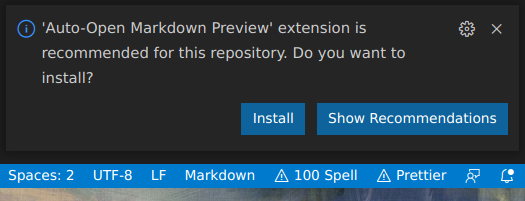

# Tailwind workshop

## Hjelpsomme tegn som går igjen

- <details><summary>Klikk her for å se noe som er skjult</summary>
  </img></details>
- 💡 Tips
- 📜 Oppgave
- 🙈 Løsningsforslag

<br/>

## Noen vennlige ord

- Ikke stress gjennom oppgavene. Du får best utbytte av å ikke hoppe rett på løsningsforslagene.
- Vær nysgjerrig, trykk på lenker, ikke kjenn på at du må bli ferdig.
- Løsningsforslag er forslag og ikke fasit.
- Spør oss om hjelp! Spør sidemannen. Se på løsningsforslag. Google. Ikke sitt i frustasjonen for lenge!
- Følg nysgjerrigheten, og still spørsmål. Det er du som skal lære og ha det gøy!

<br/>

## Lese oppgaver

Oppgavene er skrevet i markdown, og VSCode burde åpne markdown-filer i preview-mode automatisk. Dersom den ikke gjør det kan man åpne de [manuelt i preview](https://code.visualstudio.com/docs/languages/markdown#_markdown-preview) ved å trykke på preview-knappen i VSCode som vist under.


Oppgavene kan også lese på [github](https://github.com/Kodeworks/tailwind-workshop).

## Terminal på 1-2-3

<details><summary>💡 Visual Studio Code har en innebygd terminal</summary>

- Høyreklikk på en fil i filutforskeren til VSCode og velg «Open in Integrated Terminal».  
  
- Eller velg «Terminal» i menyen helt i toppen av skjermen -> «New Terminal»  

</details>
<details><summary>💡 Hvordan navigere i terminalen?</summary>

list opp mapper og filer:

```console
$ ls
```

Gå inn i mappe:

```console
$ cd mappenavn
```

Gå ut av mappe:

```console
$ cd ..
```

</details>
<details><summary>💡 Hvordan få opp flere terminaler samtidig?</summary>

Høyreklikk i terminalen i VSCode -> Velg «New Terminal» for å få den i en nye fane, eller «Split terminal» for å få to terminaler side om side.

</details>
<br/>

## Steg 1: [Klon repoet](https://docs.github.com/en/repositories/creating-and-managing-repositories/cloning-a-repository#cloning-a-repository)

---

</details>
<details><summary>💡 Ønsker du en egen kopi av repoet?</summary>

Helt frivillig: Om du ønsker en egen kopi av repoet tilknyttet din Github-konto, eller du ønsker å bruke git og pushe endringer er dette tidspunktet å [forke repoet](https://docs.github.com/en/get-started/quickstart/fork-a-repo#forking-a-repository).

Vi legger ikke opp til at du trenger git til mer enn å klone repoet.


</details>
<br/>

📜 Klon repoet

<details><summary>💡 Hvordan klone et repo?</summary>

Kopier lenken til repoet (Lenken fra ditt eget repo om du har forket det)


Åpne en terminal, og naviger til hvor du ønsker å kopiere koden.

  </details>

Klon repoet med kommandoen:

```console
$ git clone https://github.com/lenke/til/repo
```

  </details>

<br/>

## Steg 2: Er alt installert?

---

## [Visual studio Code](https://code.visualstudio.com/download)

Vi har lagt opp til å bruke VSCode som kan [lastes ned herfra](https://code.visualstudio.com/download) om du ikke allerede har det installert.

<details><summary>Hvorfor VSCode?</summary>

- Tailwind vedlikeholder en [offisiell VSCode extension](https://marketplace.visualstudio.com/items?itemName=bradlc.vscode-tailwindcss) som gir autocomplete og annet snacks.
- Det er enklere for oss å hjelpe til når vi bruker samme editor.
</details>
<br/>

## VSCode extensions

📜 Åpne mappen `tailwind-workshop` i VSCode. Det burde dukke opp en popup med anbefalte extensions som vist under, velg «Install.



<details><summary>Hvis ikke kan du legge til anbefalte extensions individuelt</summary>

> Trykk på lenken og trykk «install».

- [Tailwind CSS IntelliSense](https://marketplace.visualstudio.com/items?itemName=bradlc.vscode-tailwindcss)
- [Auto-Open Markdown Preview](https://marketplace.visualstudio.com/items?itemName=hnw.vscode-auto-open-markdown-preview)
- [Prettier - Code formatter](https://marketplace.visualstudio.com/items?itemName=esbenp.prettier-vscode)

</details>
<br/>

## [Node](https://nodejs.org/en/download/)

<br/>
📜 Åpne en terminal, og kjør følgende kommandoer (uten $):

```console
$ node -v
$ npm -v
$ npx -v
```

Dersom du får et versjonsnummer for alle kommandoene er alt klart ✅  
Hvis ikke, ta kontakt, så hjelper vi deg 🏃

## Prettier

📜 Åpne en terminal i rotmappen til prosjektet (`tailwind-workshop`) og kjør kommandoen:

```console
$ npm install
```

## Steg 3: Oppgaver med kun en HTML-fil!

---

I mappen `/kun-html` ligger [en readme med oppgaver](kun-html/README.md) hvor vi går løs på Tailwind 🚀.

## Steg 4: Oppgaver med Tailwind-konfigurasjon!

---

Vi fortsetter med å se på [oppgavene i mappen /tailwind-konfigurasjonen](/tailwind-konfigurasjon/README.md), hvor vi dykker ned i hvordan vi kan konfigurere Tailwind ⚙️.

## Steg 5: Hent mer inspirasjon!

---

♻️ Vi har sett at det er veldig enkelt å gjenbruke HTML som er stylet med Tailwind, og byggge videre på det for å lage noe eget.

📜 Bruk litt tid på å se hva som er laget med Tailwind - hva som er mulig🌟 - som en forberedelse til neste oppgave.

💡 Se etter hvilke utilities som er brukt og søk de gjerne opp opp i [dokumentasjonen](https://tailwindcss.com/docs/)! Prøv å lim inn i HTML i [kun HTML](/kun-html/index.html)-utgangspunktet vårt, eller evt. CSS og Tailwind-konfigurasjon i [Tailwind-konfigurasjonsfil](/tailwind-konfigurasjon/src/index.html)-utgangspunktet vårt.

- [Built With Tailwind CSS](https://builtwithtailwind.com/)
  - På [builtwithtailwind.com](https://builtwithtailwind.com/) er det mulig å scrolle gjennom previews av sider bygd med Tailwind. Sjekk ut hva folk har laget!
- [Tailwind UI](https://tailwindui.com/)
  - Sjekk ut [tailwindui.com](https://tailwindui.com/) som har over 500 Tailwind-komponenter _laget av folkene bak Tailwind_.
  - Fyr av ei melding til `@skjelmo` på Abakus-slacken om du vil prøve en som er bak hengelås. Har lisens på de eller fleste kompoentene, og dere kan bruke de for workshopen, men de kan dessverre ikke distribueres offentlig gjennom et git-repo.
- [Flowbite](https://flowbite.com/docs)
  - Sjekk ut [flowbite.com](https://flowbite.com/docs), som f.eks. har ferdige [skjemaer](https://flowbite.com/docs/components/forms/)
- [Gradienter for Tailwind](https://hypercolor.dev/)
  - Ferdiglagde gradienter for TailwindCSS, bare trykk på Tailwind-ikonet for å kopiere utilties!

---

🤖 Videre er Tailwind er bygget for å være konfigurerbart, og siden miljøet rundt Tailwind er stort finnes det mange ressurser for å generere Tailwind-konfigurasjon.

- [palette.app](https://palettte.app/): Brukes av folka bak Tailwind. [Introduksjon til palette.app](https://gabrieladorf.com/palettteapp/).
- [Tailwind Color Shades](https://javisperez.github.io/tailwindcolorshades/): Et enkelt verktøy for å lage fargepaletter.
- [Tailwind Gradient Generator](https://tailwind-gradient-generator.vercel.app/): For å lage gradienter med Tailwind utilties
- [tailwind-tools.com](https://www.tailwind-tools.com/): Verktøy for å generere layout med Flex eller Grid.
- Lengre liste med verktøy på [bestoftailwind.com/tools](https://bestoftailwind.com/t/tools)
- Lengre liste med verktøy på [awesome-tailwindcss](https://github.com/aniftyco/awesome-tailwindcss#tools)

## Steg 6: Hopp i det 🎢 !

---

Nå har vi ett utgangspunkt med [kun HTML](/kun-html/index.html) og ett med [HTML, CSS og egen Tailwind-konfigurasjonsfil](/tailwind-konfigurasjon/src/index.html).

Vi har gått gjennom litt av hva Tailwind har å tilby, og gått i dybden på enkelte aspekter. Samtidig er det veldig mye å utforske!

Herfra blir det mer press på deg for følge nysgjerrigheten og bruke tilgjengelige ressurser!

📜 Utforsk utilities og konsepter med Tailwind på egenhånd 🦸‍♀ ! Har en liste med mulige temaer å dykke ned i under👇

💡 Kan anbefale å lene seg på [dokumentasjonen](https://tailwindcss.com/docs/) og et [Tailwind cheat-sheet](https://nerdcave.com/tailwind-cheat-sheet).

💡 Husk å åpne `/tailwind-konfigurasjon` i et eget vindu i VSCode dersom du bruker den, for at IntelliSense skal plukke opp konfigurasjonen i `tailwind.config.js`.

- [Dark mode](https://tailwindcss.com/docs/dark-mode)
  - Det er [ikke trivielt å støtte dark-mode med CSS](https://css-tricks.com/a-complete-guide-to-dark-mode-on-the-web/), men Tailwind gjør det veldig enkelt!
- [Hover, focus og andre tilstander](https://tailwindcss.com/docs/hover-focus-and-other-states)
  - Hvordan endrer man styling når man har musen over et element, og hvordan kan vi style et element kun når det får fokus fra tastaturet? Her er [ring utilities](https://www.youtube.com/watch?v=ZbefZhgq9iQ) (video) et kult konsept fra Tailwind!
- [Responsivt design](https://tailwindcss.com/docs/responsive-design)
  - Tailwind er «responsive by design», hvordan håndterer vi at skjermstørrelsen varierer?
- [Fargepalett](https://tailwindcss.com/docs/customizing-colors)
  - Tailwind gjør det enkelt å jobbe med egne farger!
- [Flex og Grid](https://tailwindcss.com/docs/flex-basis)
  - Tailwind har gode utilities for å jobbe med layouts!
- [Bilder](https://github.com/tailwindlabs/tailwindcss-aspect-ratio)
  - Hvordan style bilder med Tailwind? De har utilities for aspect ratio, filter og mye mer!
- [Typografi](https://tailwindcss.com/docs/font-family)
  - Tailwind har masse utilities som går på tekst
- [Gradienter](https://tailwindcss.com/docs/gradient-color-stops)

Bare spør om flere muligheter for å fordype seg!

## Steg 7: Følge med på Tailwind fremover 👀 ?

---

Dersom du ønsker å følge med på hva som rører seg rundt TailwindCSS fremover kan jeg anbefale:

- ✉️ [Tailwind Weekly](https://tailwindweekly.com/): Et kort nyhetsbrev rundt CSS som tar rundt 3 minutter å lese. Sendes ut ukentlig som navnet tilsier.
- 🐦 [Adam Wathan på Twitter](https://twitter.com/adamwathan): Hovedpersonen bak TailwindCSS er aktiv på Twitter.
- 🎥 [TailwindLabs på Youtube](https://www.youtube.com/tailwindlabs): Konsise videoer fra Tailwind-teamet som [dykker ned i konkrete utilities og plugins](https://www.youtube.com/watch?v=NX_NW6bt6_s), [går gjennom nye konsepter](https://www.youtube.com/playlist?list=PL5f_mz_zU5eV0_7udNKr3qffGCkJ4Avb_) og [gjenskaper eksisterende sider med Tailwind](https://www.youtube.com/watch?v=mK-ePxnfcJw).

## Steg 8: Bruke Tailwind i en teknologistack?

---

Om du ønsker å få til funksjonalitet, eller ta i bruk Tailwind på et eksisterende prosjekt, finnes det mange ferdige setups forskjellige rammeverk.

Dersom du er kjent med React er det også satt opp en superenkel React-applikasjon laget i mappen [/react-komponenter](react-komponenter/README.md) som har fem komponenter som utgangspunkt.

### Installere fra bunnen av

[Tailwind-guide for installere med rammeverk](https://tailwindcss.com/docs/installation/framework-guides)

### Boiler-plates

- [Sanity, NextJS, React og Tailwind](https://www.sanity.io/create?template=sanity-io%2Fsanity-template-nextjs-landing-pages)
- [NextJS, React, TypeScript og Tailwind](https://github.com/ixartz/Next-js-Boilerplate)
