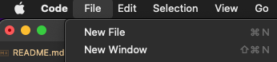

# Tailwind med React-komponenter

## Steg 1: Kom i gang

1. Åpne denne mappen `/tailwind-konfigurasjon` i et eget VSCode-vindu

   - 

💡 Åpne nytt VSCode-vindu

     Åpne terminalen i `/tailwind-konfigurasjon` og kjør kommandoen «`code .`», eller velg «File» -> «New Window» i menyen øverst:
     

 

2. Åpne en terminal og naviger til `/react-komponenter`
3. Kjør kommandoen `npm install`
4. Kjør kommandoen `npm start`

