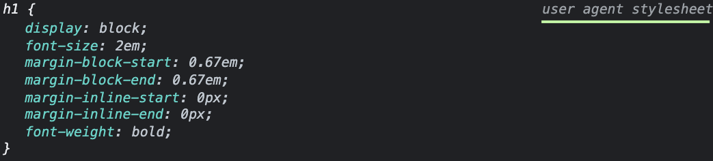

# Tailwind-konfigurasjon

## Oppgave 1: Kom i gang

---

1. Åpne en terminal, naviger til `/tailwind-konfigurasjon` og kjør kommandoen `npx @compodoc/live-server --entry-file=src/index.html`
   - Tast inn `y` for å installere om det trengs
2. Nettleseren burde åpne [index.html](index.html) automatisk.
   - Hvis ikke, åpne nettleseren og naviger til lenken det vises til i terminalen. Sannsynligvis noe annet enn [http://0.0.0.0:8080](http://0.0.0.0:8080) om du allerede kjører live-server for en annen oppgave.

🎉 Vi har et utgangspunkt! Men det ser glissent ut..

## Oppgave 2: Generer CSS

---

📜 Åpne en ny terminal (den vi åpnet før må fortsette å kjøre), naviger til `/tailwind-konfigurasjon` og kjør kommandoen `npx tailwindcss -i ./src/tailwind.css -o ./dist/output.css --watch`

💡 Hvordan? Se [Terminal på 1-2-3](../README.md).

👀 Sjekk ut nettleseren!

🎉 Vi har generert CSS med Tailwind og vår egen konfigurasjonsfil!

## Oppgave 3: Forms plugin

---

I [src/index.html](src/index.html) har vi både en tittel og et [section](https://developer.mozilla.org/en-US/docs/Web/HTML/Element/section)-element med egen tittel og et input-felt som ikke er ferdig stylet enda.

Det som er problematisk her - utenom at det ikke er ferdig stylet - er at vi har et input-felt som ser forskjellig ut i forskjellige nettlesere😱

<details><summary>👀 Klikk for å se sammenligning mellom Safari på iPhone og Chrome på Mac</summary>


</details>

<br/>

Det er ikke all verdens forskjell mellom nettleserne, men det er et problem som går igjen at forskjellige nettlesere har forskjellig _standard styling_ av form-elementer som `<input>`, `checkbox>` osv.  
Tailwind har en [offisiell plugin som heter forms](https://tailwindcss.com/docs/plugins#forms) som løser det problemet!

**Hva er plugins sier du?**  
Plugins er en måte å utvide Tailwind med styling eller utilities som av forskjellige årsaker ikke er inkludert ut av boksen.  
[Forms-pluginen](https://tailwindcss.com/docs/plugins#forms) legger på styling som gjør at alle forms-elementer ser likt ut på tvers av nettlesere.  
Konsekvensen er at det endrer styling for alle skjema-elementer. Dermed gir det mening at det er valgfritt å skru på forms-pluginen slik at man slipper å plutselig måtte gjennomgå alle eksisterende skjema-elementer.

💡 Det finnes en del plugins for funksjonalitet som i ettertid har blitt en del av Tailwind, som er verdt å ha i bakhodet før man tar i bruk en plugin som er [deprecated](https://github.com/aniftyco/awesome-tailwindcss#plugins).
<br/>

📜 Legg til Forms plugin som vist i [dokumentasjonen til forms pluginen](https://github.com/tailwindlabs/tailwindcss-forms#installation).

<details><summary>🙈 Løsningsforslag</summary>

Åpne en ny terminal, naviger til `/tailwind-konfigurasjon`, og kjør kommandoen `npm install @tailwindcss/forms`

Endre `tailwind.config.js` for Tailwind til:

```javascript
module.exports = {
  content: ["./src/**/*.{html,js}"],
  theme: {
    extend: {},
  },
  plugins: [require("@tailwindcss/forms")],
};
```

</details>

<br/>

👀 Se at terminalvinduet som genererer CSS har skrevet `Rebuilding...` i terminalen.

💡 Dersom du har stoppet prosessene vi startet i terminalen i [oppgave 1](#oppgave-1-kom-i-gang) eller [oppgave 2](#oppgave-2-generer-css) må du starte de igjen med kommandoen som står i oppgaven.

🎉 Vi har tatt i bruk Forms-pluginen, og input-feltet har endret seg litt 👀 !

## Oppgave 4: Functions & Directives

---

Det er ikke bare skjema-elementer som styles forskjellig på tvers av nettlesere. Ut av boksen kommer Tailwind med noe de kaller [preflight](https://tailwindcss.com/docs/preflight), som bl.a. fjerner default-margin som legges på av nettleseren:




<br/>

Tailwind har heldigvis et bevisst forhold til _cascading_ i CSS som vi snakket om helt i starten av presentasjonen.

De bygger opp den ferdige CSS-fila (`/dist/output.css`) ved bruk av [Functions & Directives](https://tailwindcss.com/docs/functions-and-directives) som vi har definert i [src/tailwind.css](src/tailwind.css). De legger styles fra preflight helt øverst i CSS-fila inn i `@base` som vi vist under, slik at alle CSS-selektorer vi skriver som er _like spesifikke_ får presedens pga. rekkefølgen:

```css
/**
 * This injects Tailwind's base styles and any base styles registered by
 * plugins.
 */
@tailwind base;

/**
 * This injects Tailwind's component classes and any component classes
 * registered by plugins.
 */
@tailwind components;

/**
 * This injects Tailwind's utility classes and any utility classes registered
 * by plugins.
 */
@tailwind utilities;
```
